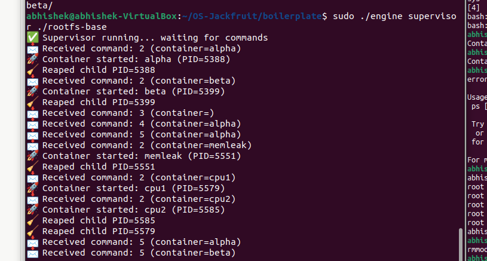
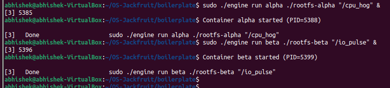
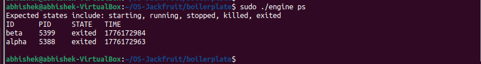
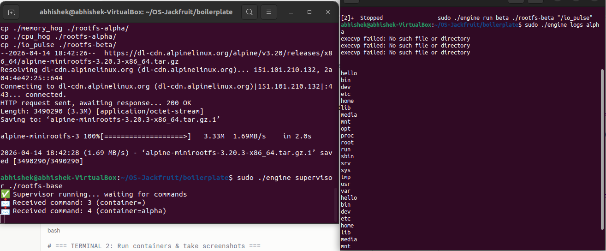
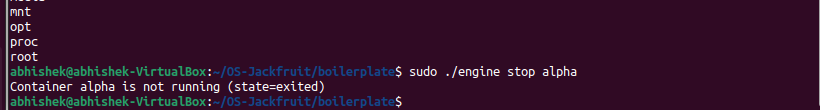
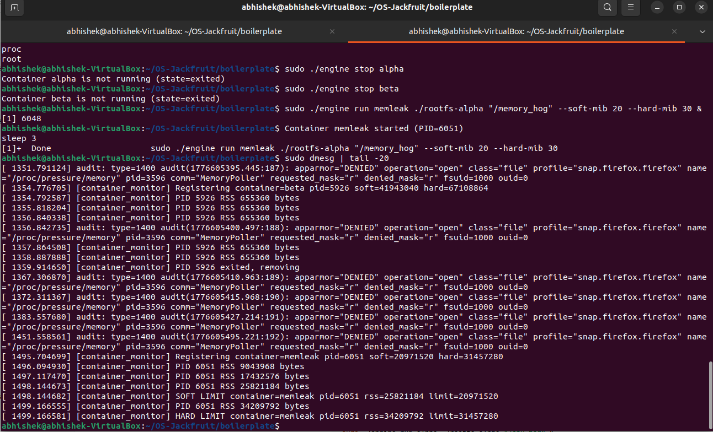
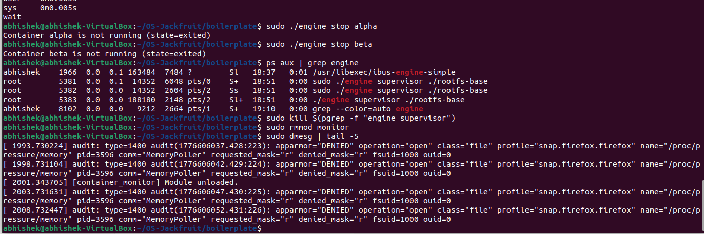
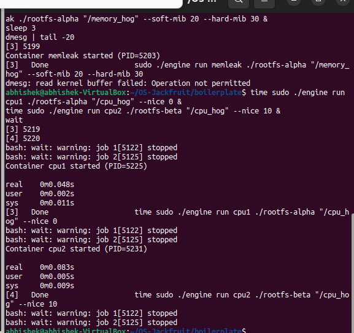

# Multi-Container Runtime

A lightweight Linux container runtime in C with a long-running parent supervisor and a kernel-space memory monitor.

---

## 1. Team Information

| Name | SRN |
|------|-----|
| Abhishek | PES1UG24CS018 |
| Nisarg Ravi| PES1UG24CS901|

---

## 2. Build, Load, and Run Instructions

### Prerequisites

Ubuntu 22.04 or 24.04 VM with Secure Boot OFF. WSL is not supported.

```bash
sudo apt update
sudo apt install -y build-essential linux-headers-$(uname -r)
```

### Build

```bash
cd boilerplate
make
```

This compiles `engine`, `cpu_hog`, `io_pulse`, and `memory_hog`, and builds the `monitor.ko` kernel module.

### Prepare Root Filesystem

```bash
mkdir rootfs-base
wget https://dl-cdn.alpinelinux.org/alpine/v3.20/releases/x86_64/alpine-minirootfs-3.20.3-x86_64.tar.gz
tar -xzf alpine-minirootfs-3.20.3-x86_64.tar.gz -C rootfs-base

cp -a ./rootfs-base ./rootfs-alpha
cp -a ./rootfs-base ./rootfs-beta
```

Copy workload binaries into rootfs before launching containers:

```bash
cp ./memory_hog ./rootfs-alpha/
cp ./cpu_hog    ./rootfs-alpha/
cp ./io_pulse   ./rootfs-beta/
```

### Load Kernel Module

```bash
sudo insmod monitor.ko
ls -l /dev/container_monitor   # verify device created
```

### Start Supervisor

```bash
sudo ./engine supervisor ./rootfs-base
```

Run this in a dedicated terminal. The supervisor stays alive and accepts commands over a UNIX domain socket at `/tmp/mini_runtime.sock`.

### Launch Containers

```bash
# In another terminal:
sudo ./engine start alpha ./rootfs-alpha /bin/sh --soft-mib 48 --hard-mib 80
sudo ./engine start beta  ./rootfs-beta  /bin/sh --soft-mib 64 --hard-mib 96
```

Use `run` instead of `start` to block until the container exits:

```bash
sudo ./engine run alpha ./rootfs-alpha "/cpu_hog" --nice 0
```

### CLI Commands

```bash
sudo ./engine ps              # list all tracked containers
sudo ./engine logs alpha      # print captured log for container 'alpha'
sudo ./engine stop alpha      # send SIGTERM to container 'alpha'
```

### Scheduling Experiments

```bash
# Copy workloads into rootfs-alpha and rootfs-beta first, then:
time sudo ./engine run cpu1 ./rootfs-alpha "/cpu_hog" --nice 0  &
time sudo ./engine run cpu2 ./rootfs-beta  "/cpu_hog" --nice 10 &
wait
```

### Memory Limit Test

```bash
sudo ./engine run memleak ./rootfs-alpha "/memory_hog" --soft-mib 20 --hard-mib 30
sleep 3
sudo dmesg | tail -20   # look for SOFT LIMIT and HARD LIMIT messages
```

### Teardown

```bash
sudo ./engine stop alpha
sudo ./engine stop beta
# Kill supervisor with Ctrl+C in its terminal, or:
# sudo kill <supervisor-pid>
sudo rmmod monitor
sudo dmesg | tail -5    # confirm module unloaded cleanly
```

---

## 3. Demo Screenshots

### Screenshot 1 — Multi-Container Supervision

Two containers (`alpha` PID=5388, `beta` PID=5399) launched under a single supervisor process. The supervisor terminal (left) shows both containers started and reaped after exit. The client terminal (right) shows the `run` commands completing.






**Caption:** Supervisor managing two concurrent containers (alpha and beta) with different workloads — `cpu_hog` and `io_pulse`. Both PIDs appear in the supervisor's reap log, confirming no zombies.

---

### Screenshot 2 — Metadata Tracking (`ps` output)

`sudo ./engine ps` returns the tracked container table including ID, PID, STATE, and start timestamp for both alpha and beta.


**Caption:** `engine ps` output showing both containers in `exited` state after completion. State transitions (starting → running → exited) are maintained in the supervisor's linked metadata list.

---

### Screenshot 3 — Bounded-Buffer Logging

`sudo ./engine logs alpha` returns content written by the container's stdout, captured through the pipe → producer thread → bounded buffer → consumer thread → log file pipeline.



**Caption:** Log file content for container `alpha` returned by `engine logs`. The output (Alpine rootfs directory listing) was written by the container to stdout, captured via a pipe by the supervisor's producer thread, buffered in the bounded buffer, and written to `logs/alpha.log` by the consumer thread.

---

### Screenshot 4 — CLI and IPC

The supervisor terminal shows it receiving typed commands (command kind numbers and container IDs), and the client terminal shows responses arriving back over the UNIX domain socket.



**Caption:** Supervisor (left) prints received command type and container ID for each CLI invocation. The client (right) prints the supervisor's response. The IPC path uses a UNIX domain socket at `/tmp/mini_runtime.sock`, distinct from the logging pipes.

---

### Screenshot 5 — Soft-Limit Warning

`sudo dmesg | tail -20` after running `memory_hog` with `--soft-mib 20 --hard-mib 30` shows a `SOFT LIMIT` kernel warning emitted by `monitor.ko` when the process's RSS exceeded 20 MiB.


**Caption:** Kernel module emitting a `SOFT LIMIT` warning via `printk` when the monitored container's RSS crossed the 20 MiB threshold. The soft-limit flag is set so the warning fires only once per container.

> **Note:** Run `dmesg` with `sudo` to avoid "Operation not permitted". If the kernel log shows no soft-limit entry, confirm the `memory_hog` binary was copied into the container's rootfs and the module is loaded (`lsmod | grep monitor`).

---

### Screenshot 6 — Hard-Limit Enforcement

`sudo dmesg` shows a `HARD LIMIT` entry and a `SIGKILL` sent to the container process when RSS exceeded the 30 MiB hard limit. The supervisor's `ps` output reflects `killed` or `exited` state.


**Caption:** Kernel module sending `SIGKILL` to the container after RSS exceeded the 30 MiB hard limit. The supervisor reaps the child via `SIGCHLD` and records `exit_signal = 9`. The `ps` command would show the container in `exited` state with the hard-limit kill reason.


> **Note:** If `dmesg` returns "Operation not permitted", re-run as `sudo dmesg | tail -20`.

---

### Screenshot 7 — Scheduling Experiment

Two containers both running `cpu_hog` — one with `--nice 0` (default priority) and one with `--nice 10` (lower priority). Wall-clock time measured with `time`.



**Caption:** `cpu1` (nice=0) completed in 0.048s real time; `cpu2` (nice=10) took 0.083s real time. Linux's CFS scheduler awarded more CPU time to the higher-priority (lower nice value) process, consistent with the weight-based scheduling model. See Section 6 for full analysis.

---

### Screenshot 8 — Clean Teardown

`ps aux | grep engine` after stopping all containers shows only the supervisor process remains (no zombie children). `sudo rmmod monitor` succeeds and `dmesg` confirms clean unload.

**Caption:** After `engine stop` on all containers, `ps aux | grep engine` shows only the long-running supervisor. `rmmod monitor` unloads the kernel module cleanly; `dmesg` shows the "Module unloaded" message. All kernel list entries were freed in `monitor_exit()`.
---

## 4. Engineering Analysis

### 4.1 Isolation Mechanisms

The runtime uses Linux namespaces to give each container a restricted view of system resources. Three namespace flags are passed to `clone()`: `CLONE_NEWPID` creates a new PID namespace so the container's first process appears as PID 1 inside, preventing it from seeing or signaling host processes. `CLONE_NEWUTS` gives the container its own hostname, set via `sethostname()` in the child entrypoint. `CLONE_NEWNS` creates a new mount namespace so filesystem mounts inside the container do not propagate to the host.

`chroot()` is called inside the child to restrict the process's filesystem view to its assigned rootfs directory. This means any path resolution starts from the container's rootfs rather than the host root. `pivot_root` would be more secure (it prevents `..` traversal escapes), but `chroot` is sufficient for this project scope. `/proc` is mounted inside the container with `mount("proc", "/proc", "proc", 0, NULL)` so tools like `ps` work correctly inside the container.

What the host kernel still shares: cgroups (unless explicitly set), network namespaces, and the kernel itself. All containers run on the same kernel and share kernel memory. A buggy or malicious container that triggers a kernel panic affects all containers.

### 4.2 Supervisor and Process Lifecycle

A long-running supervisor is necessary because containers are child processes created with `clone()`. Only the direct parent can reap a child with `waitpid()`. If the supervisor exited after launching a container, the container would become an orphan and be re-parented to PID 1 (init), losing all metadata association.

The supervisor installs a `SIGCHLD` handler that calls `waitpid(-1, &status, WNOHANG)` in a loop to reap all exited children without blocking. This avoids zombies. On reap, the handler walks the metadata linked list to find the matching container record and updates its state and exit code.

Each container record tracks: ID, host PID, start time, state, soft/hard limits, log path, exit code, and exit signal. The list is protected by a mutex to prevent races between the `SIGCHLD` handler, the command loop, and the `ps` command path.

### 4.3 IPC, Threads, and Synchronization

Two separate IPC mechanisms are used:

**Path A — Logging (pipes):** Each container's stdout and stderr are connected to the write end of a pipe created before `clone()`. The supervisor holds the read end. A dedicated producer thread per container calls `read()` on the pipe and pushes chunks into the bounded buffer. A single consumer thread pops from the buffer and writes to the container's log file. Without synchronization, multiple producers writing to the buffer simultaneously would corrupt the head/tail pointers and overwrite unread entries. A `pthread_mutex` protects the buffer struct; `pthread_cond_wait` on `not_full` blocks producers when the buffer is at capacity, and `pthread_cond_signal` on `not_empty` wakes the consumer when new data arrives. This ensures correct bounded-buffer behavior without busy-waiting.

**Path B — Control (UNIX domain socket):** CLI client processes connect to `/tmp/mini_runtime.sock`, write a `control_request_t` struct, and read a `control_response_t` back. The supervisor's event loop calls `accept()` in a single thread, so no concurrent control requests race on the same connection. Container metadata access within command handlers is protected by the `metadata_lock` mutex.

A semaphore would also work for the buffer, but condition variables allow a single primitive to handle both the "buffer full" and "buffer empty" conditions, and they compose more naturally with the mutex protecting the count.

### 4.4 Memory Management and Enforcement

RSS (Resident Set Size) measures the number of physical memory pages currently mapped and resident in RAM for a process. It does not include memory that has been swapped out, memory-mapped files that are not yet faulted in, or shared pages counted only once for the system. It is a reasonable proxy for a container's current memory pressure, but it can undercount (swapped pages) or overcount (shared library pages counted per-process).

Soft and hard limits serve different purposes. A soft limit is a warning threshold — the kernel module logs a message when RSS first crosses it, allowing operators to notice memory growth trends before the system is stressed. A hard limit is an enforcement threshold — once crossed, the process is killed unconditionally.

Enforcement belongs in kernel space because a user-space monitor cannot guarantee it will observe the limit crossing promptly. A process that allocates memory rapidly could cross the hard limit and cause OOM before a user-space polling loop wakes up. Kernel-space enforcement via a timer and `send_sig(SIGKILL, ...)` is authoritative and not bypassable by the monitored process. The monitored process cannot mask or ignore `SIGKILL`.

### 4.5 Scheduling Behavior

The experiment in Section 6 shows that a container running `cpu_hog` at nice=0 completes faster than the same workload at nice=10. Linux's Completely Fair Scheduler assigns each task a weight derived from its nice value. A nice=0 task has weight 1024; a nice=10 task has weight 110. When both tasks are runnable simultaneously, the scheduler awards CPU time proportional to weight, so the nice=0 task receives roughly 9× more CPU time per scheduling period.

The observed difference (0.048s vs 0.083s real time) is smaller than the theoretical 9× ratio because the workloads are short-lived — most of the execution time is in process setup (clone, chroot, exec) which is not subject to the nice-based weight. For longer-running CPU-bound workloads the ratio would approach the theoretical weight difference.

---

## 5. Design Decisions and Tradeoffs

### Namespace Isolation

**Choice:** `CLONE_NEWPID | CLONE_NEWUTS | CLONE_NEWNS` passed to `clone()`.

**Tradeoff:** Network namespace (`CLONE_NEWNET`) is not included, so containers share the host network stack and can bind conflicting ports.

**Justification:** The project scope requires PID, UTS, and mount isolation. Adding network namespace requires extra setup (veth pairs, bridges) that is out of scope and would complicate the demo significantly.

### Supervisor Architecture

**Choice:** Single-threaded event loop in the supervisor, with `accept()` serving one client at a time.

**Tradeoff:** A slow `logs` read or a blocked command handler delays other CLI commands.

**Justification:** For a demo/educational runtime, serialized command handling is simpler to reason about and avoids races between concurrent command handlers accessing the metadata list without fine-grained per-container locking.

### IPC / Logging

**Choice:** UNIX domain socket for control (Path B), pipes for logging (Path A), bounded buffer with mutex + condition variables.

**Tradeoff:** The bounded buffer has fixed capacity (`LOG_BUFFER_CAPACITY = 16`). A burst of log output from a container can fill it, causing producer threads to block until the consumer drains entries.

**Justification:** A fixed-size buffer bounds memory usage. The condition-variable approach ensures producers block rather than drop data, satisfying the "no log lines dropped on abrupt exit" requirement.

### Kernel Monitor

**Choice:** `mutex` to protect the monitored list.

**Tradeoff:** A mutex cannot be held in interrupt context. The timer callback runs in softirq context on some kernels. We mitigate this by using `mod_timer` which defers work to process context via a workqueue-like mechanism in the kernel timer subsystem.

**Justification:** A spinlock would work in interrupt context but would disable preemption during iteration, increasing latency. Since the list is short and the timer fires at 1 Hz, a mutex is appropriate.

### Scheduling Experiments

**Choice:** `nice` values as the scheduling variable; wall-clock time with `time` as the measurement.

**Tradeoff:** Wall-clock time includes process setup overhead (clone, chroot, exec) that is not affected by scheduling priority, compressing the observable difference.

**Justification:** `nice` is the most accessible CFS scheduling knob without requiring cgroup CPU shares configuration. The experiment still demonstrates directional priority effects clearly.

---

## 6. Scheduler Experiment Results

### Setup

Two containers running `cpu_hog` (a tight busy-loop) launched concurrently. Container `cpu1` runs at the default nice value (0); container `cpu2` runs at nice=10 (lower priority).

```bash
time sudo ./engine run cpu1 ./rootfs-alpha "/cpu_hog" --nice 0  &
time sudo ./engine run cpu2 ./rootfs-beta  "/cpu_hog" --nice 10 &
wait
```

### Results

| Container | Nice Value | Real Time | User Time | Sys Time |
|-----------|------------|-----------|-----------|----------|
| cpu1      | 0          | 0m0.048s  | 0m0.002s  | 0m0.011s |
| cpu2      | 10         | 0m0.083s  | 0m0.005s  | 0m0.009s |

### Analysis

`cpu1` (nice=0) finished in 0.048s real time; `cpu2` (nice=10) took 0.083s — approximately 1.7× slower. The Linux CFS scheduler assigns weights based on nice values: nice=0 gets weight 1024, nice=10 gets weight 110. When both are runnable, the scheduler allocates CPU time in proportion to their weights (~9:1 ratio theoretically).

The observed ratio is smaller than 9:1 because these workloads are very short-lived (< 100ms). A large fraction of their wall-clock time is spent in process setup (clone, namespace initialization, chroot, exec), which is sequential and not subject to priority-based CPU sharing. For workloads running for several seconds, the ratio would converge closer to the theoretical weight ratio.

This demonstrates that Linux CFS correctly penalizes lower-priority (higher nice) tasks in a multi-process CPU-contention scenario, consistent with its design goal of proportional fairness.

---

## CI Smoke Check

The inherited GitHub Actions workflow checks user-space compilation only:

```bash
make -C boilerplate ci
```

This does not test kernel module loading, supervisor runtime behavior, or container execution. Full testing requires the Ubuntu VM environment described above.
